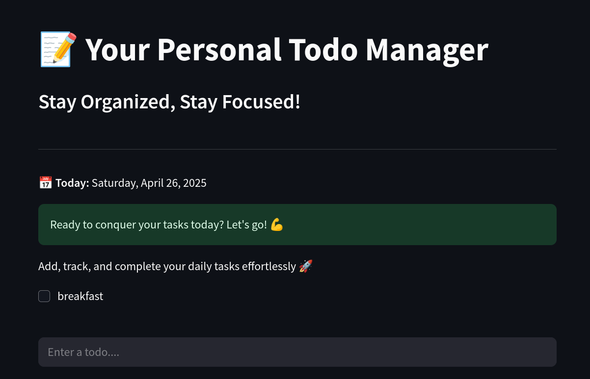

# 📝 Streamlit To-Do App

<p align="center">
  
</p>

A simple and clean **to-do list** web application, built using [Streamlit](https://streamlit.io/).

🌐 [Try the Live App](https://todo-asheshjyoti.streamlit.app/)

---

## ✨ Features

- Quickly add and manage tasks
- Mark tasks as completed
- Minimal and easy-to-use interface

---

## 🚀 Getting Started

To run the app locally:

```bash
git clone https://github.com/your-username/your-repo-name.git
cd your-repo-name
pip install streamlit
streamlit run app.py
```

---

## 📚 About

This project was built as a small exercise to learn and practice **Streamlit**.  
Thank you for taking the time to explore it. 🙏  
Created by [Ashesh Jyoti Majumdar](https://www.linkedin.com/in/asheshjyoti/).

